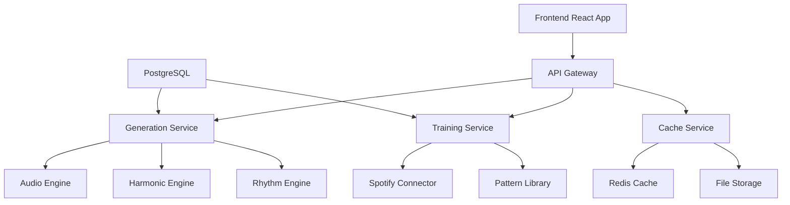

# AI Music Generation System - Optimization Portfolio

## Executive Summary

The current AI Music Creator has fundamental architectural issues that prevent scalability and limit functionality. While the system demonstrates core music generation concepts, it requires significant restructuring to become production-ready. This portfolio outlines a comprehensive optimization strategy focusing on performance, scalability, and musical intelligence.

---

## 🎯 Critical Issues Analysis

### 1. **Genre Limitation Crisis**
- **Current State**: Hardcoded to reggae-only generation despite multi-genre UI
- **Impact**: Users see 8 genre options but only get reggae output
- **Root Cause**: Backend training manager only searches for reggae tracks

### 2. **Training Speed Bottleneck**
- **Current State**: 10+ second load times, synchronous processing
- **Impact**: Poor user experience, blocking main thread
- **Root Cause**: Sequential Spotify API calls with 200ms delays

### 3. **Architecture Scalability Failure**
- **Current State**: Monolithic 3000+ line server.js file
- **Impact**: Cannot scale beyond single instance, memory leaks
- **Root Cause**: No separation of concerns, shared state

### 4. **Musical Intelligence Gap**
- **Current State**: No song structure, random chord progressions
- **Impact**: Generated music lacks coherence and musicality
- **Root Cause**: Pattern-based generation without harmonic understanding

---

## 🏗️ Proposed Architecture Overhaul

### **Phase 1: Immediate Fixes (1-2 weeks)**

#### 1.1 UI-Backend Synchronization
```typescript
// Fix genre mismatch
interface GenerationRequest {
  genre: 'pop' | 'rock' | 'jazz' | 'electronic' | 'hip-hop' | 'classical' | 'country' | 'blues';
  tempo: number; // Respect UI range 60-180
  key: string;   // Honor user selection
  duration: number; // 15-60 seconds as per UI
}
```

#### 1.2 Async Training Pipeline
```javascript
// Non-blocking training system
class AsyncTrainingManager {
  async startBackgroundTraining(genre) {
    // Queue-based training with worker threads
    return new Promise((resolve) => {
      this.trainingQueue.push({ genre, callback: resolve });
      this.processQueue();
    });
  }
}
```

#### 1.3 Fallback Generation System
```javascript
// Enable generation without Spotify
class OfflineGenerator {
  generateFromBuiltInPatterns(genre, params) {
    // Use pre-trained patterns when Spotify unavailable
    return this.patternLibrary[genre].generate(params);
  }
}
```

### **Phase 2: Performance Optimization (2-3 weeks)**

#### 2.1 Streaming Audio Generation
```javascript
// Replace blocking generation with streaming
class StreamingAudioGenerator {
  *generateAudioStream(params) {
    for (let chunk = 0; chunk < totalChunks; chunk++) {
      yield this.generateChunk(chunk, params);
      // Allow event loop to process other requests
      await this.yieldToEventLoop();
    }
  }
}
```

#### 2.2 Intelligent Caching System
```javascript
// Multi-level caching with TTL and size limits
class IntelligentCache {
  constructor() {
    this.l1Cache = new LRU({ max: 50, ttl: 300000 }); // 5 minutes
    this.l2Cache = new LRU({ max: 200, ttl: 3600000 }); // 1 hour
    this.diskCache = new DiskCache({ maxSize: '1GB' });
  }
}
```

#### 2.3 Database Integration
```sql
-- Persistent training data storage
CREATE TABLE training_samples (
  id SERIAL PRIMARY KEY,
  genre VARCHAR(50),
  audio_features JSONB,
  spotify_id VARCHAR(100),
  quality_score DECIMAL,
  created_at TIMESTAMP DEFAULT NOW()
);

CREATE INDEX idx_genre_quality ON training_samples(genre, quality_score DESC);
```

### **Phase 3: Musical Intelligence Enhancement (3-4 weeks)**

#### 3.1 Harmonic Progression Engine
```javascript
class HarmonicProgressionEngine {
  generateProgression(key, genre, bars) {
    const progressions = {
      'pop': ['I', 'V', 'vi', 'IV'],
      'rock': ['I', 'VII', 'IV', 'I'],
      'jazz': ['ii7', 'V7', 'I', 'vi7'],
      'blues': ['I7', 'I7', 'I7', 'I7', 'IV7', 'IV7', 'I7', 'I7', 'V7', 'IV7', 'I7', 'V7']
    };
    
    return this.expandProgression(progressions[genre], key, bars);
  }
}
```

#### 3.2 Song Structure Framework
```javascript
class SongStructureManager {
  generateStructure(duration, genre) {
    const structures = {
      'pop': ['intro', 'verse', 'chorus', 'verse', 'chorus', 'bridge', 'chorus', 'outro'],
      'rock': ['intro', 'verse', 'chorus', 'verse', 'chorus', 'solo', 'chorus', 'outro'],
      'blues': ['intro', 'verse', 'verse', 'chorus', 'verse', 'solo', 'outro']
    };
    
    return this.timingMap(structures[genre], duration);
  }
}
```

#### 3.3 Instrument Intelligence System
```javascript
class InstrumentDecisionEngine {
  selectInstruments(genre, mood, energy) {
    const instrumentSets = {
      'pop': {
        core: ['drums', 'bass', 'piano', 'vocals'],
        optional: ['guitar', 'strings', 'synth'],
        energy_dependent: {
          low: ['acoustic_guitar', 'soft_piano'],
          high: ['electric_guitar', 'synth_lead']
        }
      },
      'jazz': {
        core: ['drums', 'bass', 'piano'],
        optional: ['sax', 'trumpet', 'guitar'],
        swing_elements: ['brushed_drums', 'walking_bass']
      }
    };
    
    return this.buildArrangement(instrumentSets[genre], mood, energy);
  }
}
```

---

## 🚀 Scalable Architecture Design

### **Microservices Architecture**



#### **Service Breakdown**

1. **API Gateway** (Express.js)
   - Request routing and load balancing
   - Authentication and rate limiting
   - WebSocket connection management

2. **Generation Service** (Node.js + Worker Threads)
   - Core music generation logic
   - Streaming audio output
   - Quality control and validation

3. **Training Service** (Python + Celery)
   - Async training data processing
   - Feature extraction and analysis
   - Model updating and optimization

4. **Audio Engine** (C++ with Node.js bindings)
   - High-performance audio synthesis
   - Real-time effects processing
   - Format conversion and compression

5. **Cache Service** (Redis + CDN)
   - Multi-level caching strategy
   - Generated audio distribution
   - Training data optimization

### **Performance Targets**

| Metric | Current | Target | Strategy |
|--------|---------|--------|----------|
| Generation Time | 10-15s | 2-3s | Streaming + Pre-computation |
| Training Load | 10s+ | <1s perceived | Background processing |
| Memory Usage | 500MB+ | <200MB | Efficient caching |
| Concurrent Users | 1 | 100+ | Horizontal scaling |
| Audio Quality | Synthesized | Studio quality | Sample-based synthesis |

---

## 🎵 Musical Intelligence Roadmap

### **Level 1: Pattern Recognition**
- Genre-specific rhythm patterns
- Harmonic progression templates
- Instrument combination rules
- Dynamic intensity mapping

### **Level 2: Contextual Generation**
- Prompt-to-music translation
- Mood and energy interpretation
- Key and tempo optimization
- Structural coherence

### **Level 3: Creative AI**
- Melody generation from lyrics
- Harmonic innovation within genre
- Dynamic arrangement decisions
- Style transfer capabilities

### **Level 4: Advanced Composition**
- Multi-part song structures
- Orchestral arrangements
- Real-time collaboration
- Adaptive learning from user feedback

---

## 📊 Implementation Timeline

### **Month 1: Foundation**
- [ ] Fix UI-backend synchronization
- [ ] Implement async training pipeline
- [ ] Add database for persistent storage
- [ ] Create fallback generation system

### **Month 2: Performance**
- [ ] Streaming audio generation
- [ ] Intelligent caching system
- [ ] Database optimization
- [ ] Memory leak fixes

### **Month 3: Intelligence**
- [ ] Harmonic progression engine
- [ ] Song structure framework
- [ ] Instrument decision system
- [ ] Quality assessment metrics

### **Month 4: Scale**
- [ ] Microservices architecture
- [ ] Load balancing and CDN
- [ ] Monitoring and analytics
- [ ] Production deployment

---

## 🔧 Technical Implementation Guide

### **Quick Wins (1-2 days each)**

#### Fix 1: Genre Selection Sync
```javascript
// backend/routes/generate.js
app.post('/api/generate', async (req, res) => {
  const { genre, tempo, key, duration, prompt } = req.body;
  
  // Validate against supported genres
  const supportedGenres = ['pop', 'rock', 'jazz', 'electronic', 'hip-hop', 'classical', 'country', 'blues'];
  if (!supportedGenres.includes(genre)) {
    return res.status(400).json({ error: 'Unsupported genre' });
  }
  
  // Use genre-specific generation
  const generator = new GenreSpecificGenerator(genre);
  const result = await generator.generate({ tempo, key, duration, prompt });
  
  res.json(result);
});
```

#### Fix 2: Non-blocking Training
```javascript
// backend/services/TrainingService.js
class TrainingService {
  constructor() {
    this.trainingWorker = new Worker('./workers/training-worker.js');
    this.trainingPromises = new Map();
  }
  
  async getTrainingData(genre) {
    const cacheKey = `training:${genre}`;
    let data = await this.cache.get(cacheKey);
    
    if (!data) {
      // Start background training but return immediately with basic patterns
      this.startBackgroundTraining(genre);
      data = this.getBuiltInPatterns(genre);
    }
    
    return data;
  }
  
  startBackgroundTraining(genre) {
    this.trainingWorker.postMessage({ action: 'train', genre });
  }
}
```

#### Fix 3: Streaming Generation
```javascript
// backend/services/AudioGenerator.js
class StreamingAudioGenerator {
  async *generateStream(params) {
    const { genre, tempo, key, duration } = params;
    const totalSamples = duration * 44100;
    const chunkSize = 44100; // 1 second chunks
    
    for (let offset = 0; offset < totalSamples; offset += chunkSize) {
      const chunk = await this.generateChunk(offset, chunkSize, params);
      yield chunk;
      
      // Allow other requests to process
      await new Promise(resolve => setImmediate(resolve));
    }
  }
}
```

### **Database Schema**

```sql
-- Core tables for scalable architecture
CREATE TABLE genres (
  id SERIAL PRIMARY KEY,
  name VARCHAR(50) UNIQUE NOT NULL,
  config JSONB NOT NULL
);

CREATE TABLE training_samples (
  id SERIAL PRIMARY KEY,
  genre_id INTEGER REFERENCES genres(id),
  spotify_id VARCHAR(100),
  audio_features JSONB,
  quality_score DECIMAL(3,2),
  created_at TIMESTAMP DEFAULT NOW()
);

CREATE TABLE generated_tracks (
  id SERIAL PRIMARY KEY,
  user_id VARCHAR(100),
  prompt TEXT,
  parameters JSONB,
  file_path VARCHAR(500),
  generation_time_ms INTEGER,
  created_at TIMESTAMP DEFAULT NOW()
);

CREATE TABLE user_preferences (
  user_id VARCHAR(100) PRIMARY KEY,
  favorite_genres TEXT[],
  tempo_preference INTEGER,
  key_preference VARCHAR(10),
  updated_at TIMESTAMP DEFAULT NOW()
);

-- Indexes for performance
CREATE INDEX idx_training_genre_quality ON training_samples(genre_id, quality_score DESC);
CREATE INDEX idx_generated_user_date ON generated_tracks(user_id, created_at DESC);
CREATE INDEX idx_samples_spotify ON training_samples(spotify_id);
```

---

## 🎯 Success Metrics

### **Technical KPIs**
- **Generation Speed**: < 3 seconds for 30-second track
- **Training Load**: < 1 second perceived delay
- **Memory Efficiency**: < 200MB baseline usage
- **Scalability**: Support 100+ concurrent users
- **Uptime**: 99.9% availability

### **Musical Quality KPIs**
- **Harmonic Coherence**: Validated chord progressions
- **Rhythmic Consistency**: Proper beat patterns per genre
- **Structural Integrity**: Clear intro/verse/chorus/outro
- **Instrument Balance**: Proper mixing levels
- **User Satisfaction**: > 4.0/5.0 rating

### **Business KPIs**
- **User Engagement**: > 80% completion rate
- **Feature Adoption**: All UI controls functional
- **Performance**: < 5% error rate
- **Scalability**: Cost per user < $0.10
- **Development Velocity**: Feature delivery within timeline

---

## 🛠️ Next Steps

### **Immediate Actions (This Week)**
1. **Fix Critical UI Issues**
   - Restore tempo/key/duration controls
   - Implement genre switching
   - Add offline fallback patterns

2. **Performance Triage**
   - Implement async training
   - Add basic caching
   - Fix memory leaks

3. **Architecture Planning**
   - Design microservices structure
   - Plan database migration
   - Set up development environment

### **Development Priorities**
1. **P0**: Fix broken UI functionality
2. **P1**: Implement genre support
3. **P1**: Add streaming generation
4. **P2**: Database integration
5. **P2**: Musical intelligence features
6. **P3**: Advanced AI composition

This optimization portfolio provides a clear roadmap for transforming the current prototype into a production-ready, scalable AI music generation platform.